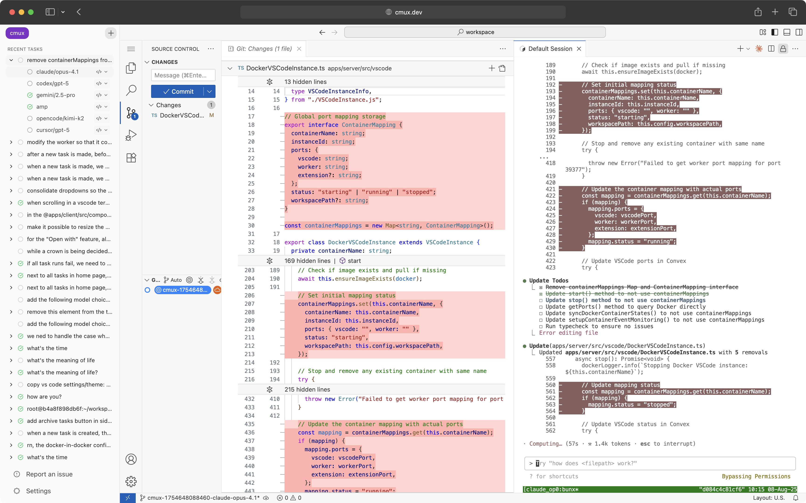

<h1 align="center">cmux</h1>
<p align="center">open source Claude Code manager that supports Codex/Gemini/Cursor/OpenCode/Amp CLI</p>

<p align="center"><code>bunx cmux</code> or <code>npx cmux</code></p>

cmux lets you spawn Claude Code, Codex CLI, Cursor CLI, Gemini CLI, Amp, Opencode, and other coding agent CLIs in parallel across multiple tasks.

Each agent gets an isolated Docker container.

Each sandbox opens VS Code with a git diff UI and a terminal with the corresponding CLI.



## Install

cmux supports macOS Apple Silicon. macOS x64, Linux, and Windows support coming soon.

```bash
# with bun
bunx cmux@latest

# with npm
npx cmux@latest

# with uv
uvx cmux@latest
```

<!-- ## Upgrade

```bash
cmux upgrade
``` -->

## Uninstall

```bash
cmux uninstall
```
